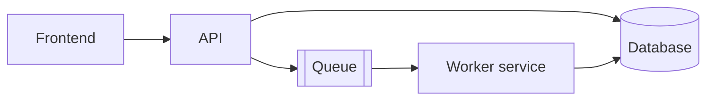

# System design

The document that describes how the system is built and why. Feature designs in `docs/specs/<feature>/design.md` link here and never repeat it. The lead owns this file. It is updated in the same PR as any change that makes it wrong.

Write it for two readers: a developer joining next month, and an agent starting a session with no memory. Both need the same thing, which is the shape of the system and the reasons behind the shape. Neither needs a file-by-file tour; the code is the tour.

Target length: 1,500 to 3,000 words. Longer than that and it stops being read at session start. Split detail into ADRs and feature designs.

## 1. Context

What the system does, for whom, and the one or two constraints that shaped everything else.

## 2. Components

One paragraph per deployable unit. Name, responsibility, technology, how it is deployed, and what it must never do. A diagram is welcome if it is kept in the repo as text (Mermaid) so it can be diffed.

## 3. Core flows

The three to five flows that matter, as numbered steps. Example from a document-processing product:

1. Upload. The user uploads a file through the frontend.
2. Store. The API saves the blob and creates the database record.
3. Extract. The worker downloads the blob, runs OCR locally, then structured extraction.
4. Score. Type-specific rules score the extraction and flag low-confidence documents.
5. Review. Flagged documents appear in a review queue. Corrections are saved as training data.

Each step names the component that owns it. If a step's rules are subtle, say where they live and link the ADR.

## 4. Boundaries and contracts

Every place two components agree on a shape: API routes, queue messages, shared field names, generated manifests. For each: where the contract file lives, which tests guard it on each side, and the command that regenerates it. See `docs/contracts.md` for the pattern.

## 5. Data

The entities that matter and the relationships between them. Not every table. The rule for what belongs here: if renaming it would break more than one component, it belongs here.

## 6. Cross-cutting decisions

Authentication and tenancy. Error handling and logging. Configuration. Background work. Each as a short paragraph with a link to the ADR that decided it.

## 7. Deliberate deviations

Things that look wrong on purpose. Example: "The document page validates HS codes but never assigns them. Assignment happens in one place, the search modal, so a code is only ever chosen through one path." This section is what stops an agent from fixing something that is not broken.

## 8. Known gaps

What the system does not yet do and what is planned. Link the spec if one exists. Keep this list short by moving items out as they ship.

## 9. Decision log

A table of ADRs by number, title, date and status. Generated or hand-maintained, either is fine as long as it is current.

| ADR | Title | Date | Status |
|---|---|---|---|
| 0001 | Example: hosted extraction engine as a bridge | | Accepted |
